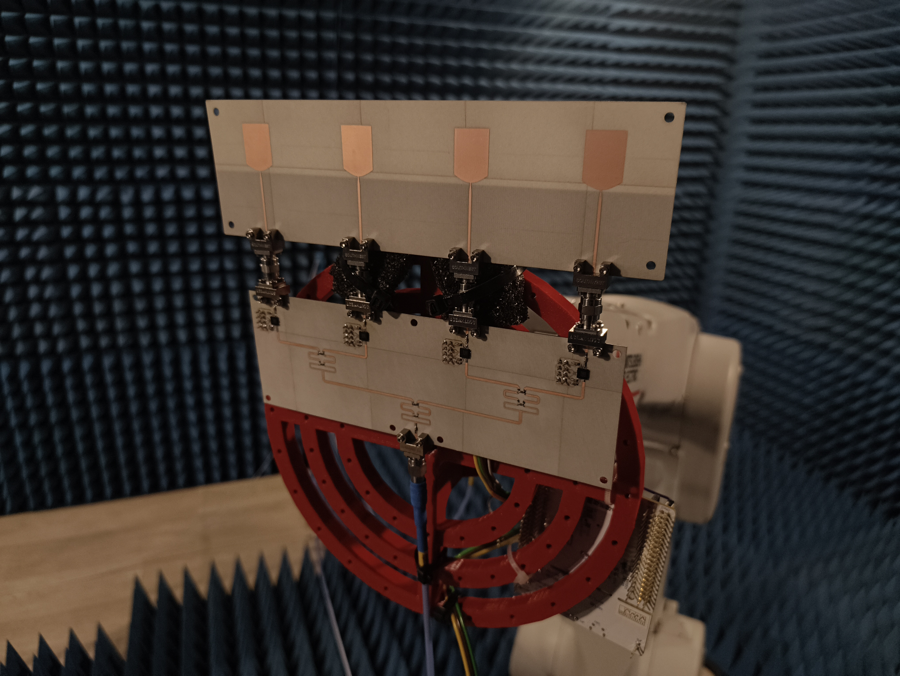

# Phased Antenna Array

[Phased Array Antenna Working in 2.4 GHz ISM Band](thesis.pdf)

  

[Phase-Shifter](https://github.com/kamilix2003/Phase-Shifter) - repository containing hardware and firmware implementation used for the thesis
